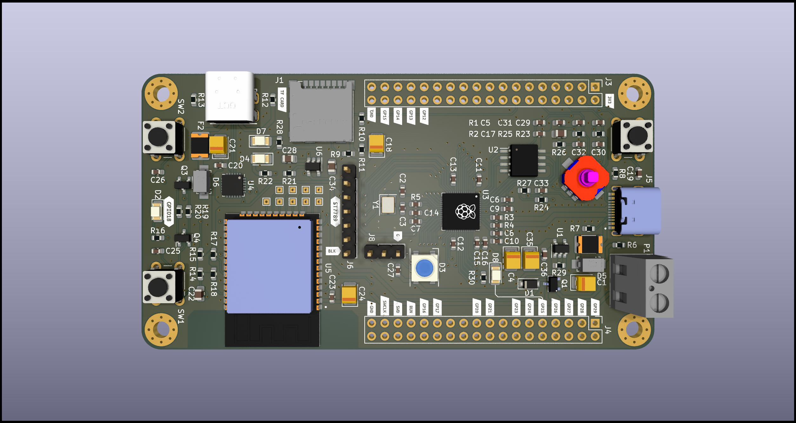
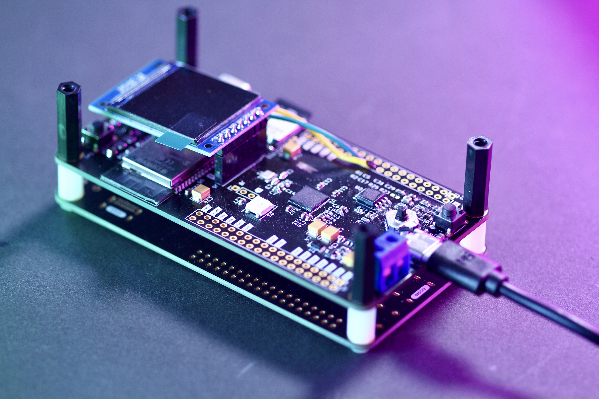

# Watch the video

# license

* will be updated soon. (feel free to tinker for you personal use)

# rp2040-esp32-experiment-board

Experiment board using RP2040 and ESP32
The purpose of this board is to confirm or practice the following things:

* UART communication between RP2040 and ESP32 makes it behaves like Raspberry Pi Pico W
* test joystick with RP2040
* soldering different USB-C type receptacles
* test lipo battery charging chip
* test SD card with RP2040

The PCB is desing with KiCad, manufactured by JLCPCB.

# Kicad render (LED for RP2040 added)

# schematic

# the first version

